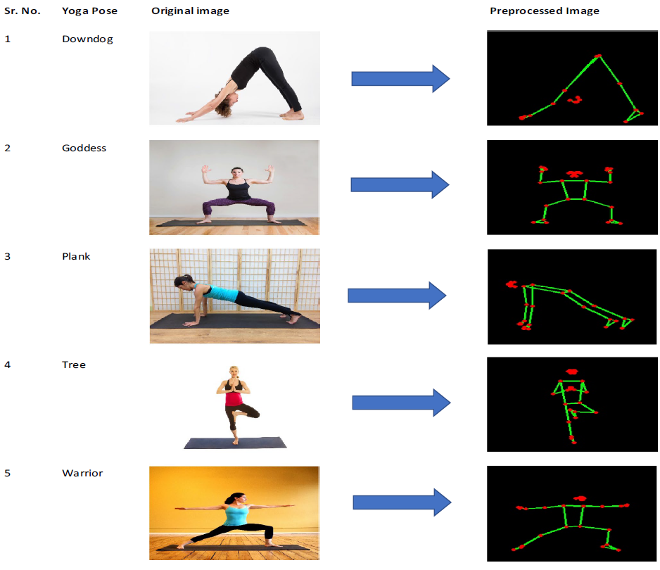
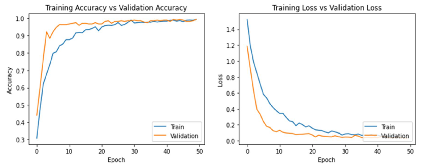
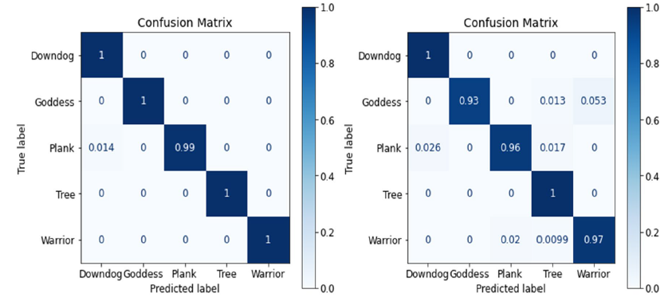

# Yoga Pose Classification using CNN and MediaPipe

This repository contains an implementation of a deep learning approach for yoga pose classification using Convolutional Neural Networks (CNN) and MediaPipe for body keypoint detection.

## Features
- **Dataset**: Utilizes a dataset of yoga poses with images processed using MediaPipe.
- **Model Architecture**: Implements a custom CNN model (YogaConvo2d) and compares it with transfer learning models like VGG16, InceptionV3, InceptionResNetV2, and NASNetMobile.
- **Skeletonization**: Uses MediaPipe to skeletonize images, improving classification accuracy.
- **Training**: Includes training scripts with loss and accuracy tracking.
- **Evaluation**: Provides detailed performance metrics, confusion matrices, and comparison with state-of-the-art models.

Dataset link: https://drive.google.com/file/d/1yjzXqma96Xq-tX3dI8AvmjTDSqB2UR-i/view?usp=sharing

<p align="center">
  
</p>

## Setup and Usage

### Clone the Repository
```bash
git clone [https://github.com/yourusername/yoga_pose_classification.git](https://github.com/shub-garg/Yoga-Pose-Skeletonization-and-Classification)
cd Yoga_Pose_Skeletonization_and_Classification
```

### Launch Jupyter Notebook
```bash
jupyter notebook cnn-yoga.ipynb
```

### Run All Cells
Execute all cells in the notebook to preprocess data, define models, and start the training process.

### Results and Observations
Training and Validation Accuracy: Detailed accuracy and loss graphs for YogaConvo2d.
Confusion Matrix: Displays the confusion matrix for model evaluation.

### Results Table
| Model                        | Accuracy (Validation) | Accuracy (Test) | Precision | Recall | F1 Score |
|------------------------------|-----------------------|-----------------|-----------|--------|----------|
| YogaConvo2d (MediaPipe)      | 99.62%                | 97.09%          | 0.97      | 0.97   | 0.97     |
| YogaConvo2d (Non-MediaPipe)  | 89.97%                | 89.36%          | 0.89      | 0.88   | 0.89     |
| InceptionV3 (MediaPipe)      | 95.09%                | 94.39%          | 0.95      | 0.94   | 0.94     |
| InceptionV3 (Non-MediaPipe)  | 94.98%                | 94.04%          | 0.94      | 0.94   | 0.94     |
| NASNetMobile (MediaPipe)     | 96.23%                | 94.39%          | 0.94      | 0.95   | 0.95     |
| NASNetMobile (Non-MediaPipe) | 94.31%                | 92.77%          | 0.94      | 0.92   | 0.93     |
| InceptionResNetV2 (MediaPipe)| 96.60%                | 95.29%          | 0.95      | 0.95   | 0.95     |
| InceptionResNetV2 (Non-MediaPipe) | 89.30%          | 86.81%          | 0.87      | 0.86   | 0.86     |
| VGG16 (MediaPipe)            | 97.36%                | 96.86%          | 0.97      | 0.97   | 0.97     |
| VGG16 (Non-MediaPipe)        | 95.60%                | 95.53%          | 0.96      | 0.95   | 0.96     |

Example Plots
Accuracy and Loss Curves
<p align="center">
  
</p>
Confusion Matrix
<p align="center">
  
</p>
For more details, please refer to the following paper:


    @article{Garg:2023,
      Author = {Shubham Garg and Aman Saxena and Richa Gupta},
      Title = {Yoga pose classification: a CNN and MediaPipe inspired deep learning approach for real-world application},
      Year = {2023},
      Journal = {Journal of Ambient Intelligence and Humanized Computing},
      Volume = {14},
      Number = {12},
      Pages = {16551--16562},
      Publisher = {Springer},
      Howpublished = {\url{https://link.springer.com/article/10.1007/s12652-022-03910-0}}
    } 

    
[Link to paper](https://link.springer.com/article/10.1007/s12652-022-03910-0).
